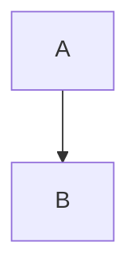

<!-- _blueprint/knowledge/blueprint_schema.md -->

# Blueprint Schema (Normative)
This document defines the **canonical, deterministic schema** for producing a *Machine-Executable Blueprint* for **native C++ apps and libraries**.  
It is designed to be read by AI coding agents that will generate production-grade repositories.

## 1. Precedence & Interpretation
**Precedence order (highest → lowest):**
1) The system/prompt hard rules (Traceability, Deterministic Structure, Debug Cleanliness, Lifecycle)  
2) This schema document (**normative**)  
3) User-provided Software Description and constraints  
4) Reasonable assumptions (must be declared under **[META-03]**)

If a conflict exists, the higher-precedence rule wins. Conflicts must be recorded as a decision under **[DEC-XX]**.

---

## 2. Traceability IDs (Normative)
### 2.1 Prefixes (allowed)
- **[META-XX]** metadata/assumptions/risks  
- **[SCOPE-XX]** scope & boundaries  
- **[REQ-XX]** requirements  
- **[ARCH-XX]** architecture rules  
- **[DEC-XX]** decisions (rationale + alternatives)  
- **[MEM-XX]** memory model  
- **[CONC-XX]** concurrency  
- **[API-XX]** public API/ABI  
- **[PY-XX]** Python bindings (optional)  
- **[BUILD-XX]** build/toolchain/deps  
- **[TEST-XX]** tests/verification/perf validation  
- **[VER-XX]** versioning/lifecycle/compat/migrations  
- **[CR-XXXX]** Change Requests (under `/blueprint/cr/`)  
- **[TEMP-DBG]** temporary debug markers (special, not numbered)

### 2.2 ID format rules
- `XX` is **two digits**: `01..99` (example: `[REQ-04]`)  
- `CR` uses **four digits**: `0001..9999` (example: `[CR-0042]`)  
- IDs must be **stable**: do **not** renumber across Blueprint revisions  
- Each ID maps to **exactly one** major rule/constraint/decision  
- Every major architectural decision must have a **[DEC-XX]** entry with:
  - Context
  - Decision
  - Alternatives considered
  - Consequences (pros/cons, risks)

### 2.3 “ID-in-every-major-line” rule
Any line introducing a major requirement or constraint must contain an ID, e.g.:
- `[REQ-07] p99 latency must be ≤ 2ms under target load`
- `[ARCH-03] Linux kernel 5.15+ is required`

---

## 3. Mandatory Repository Convention
Blueprint assumes the repo contains:

```
/blueprint/
  blueprint_vX.Y.md
  decision_log.md
  walkthrough.md
  implementation_checklist.yaml
  cr/
    CR-XXXX.md
/src/
/include/
/tests/
/docs/
/tools/
/examples/   (if applicable)
```

**Rule:** `/blueprint` is the **source of truth**.  
Significant changes must be made via a CR and reflected in `/blueprint` **before or alongside** code.

---

## 4. Output Formatting Rules (Normative)
- Output is **Markdown** with **exact headings** as defined in §5  
- Use **tables** for: budgets, platform matrix, dependencies, compatibility  
- Use **Mermaid** for diagrams (C4 + dataflow/memory)  
- If something is not applicable: write `N/A` and explain with a **[DEC-XX]**
- Public headers are **sketches**: signatures only (no full implementations)
- End with **Appendix E** containing a YAML block: `implementation_checklist`

### 4.1 Mermaid blocks
Use fenced blocks:


### 4.2 Tables (minimum fields)
**Performance budgets table** should include:
- CPU (core count assumptions if relevant)
- Memory (steady-state + peak)
- Latency targets (p50/p99/p999)
- Throughput (ops/s, frames/s, etc.)
- Startup time (if relevant)
- GPU budget (if relevant)

---

## 5. Blueprint Structure (Canonical)
The Blueprint must be emitted in this exact order.

### Chapter 0: Blueprint Metadata
- [META-01] version/date/repo name  
- [META-02] glossary  
- [META-03] assumptions  
- [META-04] risks/open questions  
- [META-05] required `/blueprint` files for this version

### Chapter 1: Scope & North Star
- [SCOPE-01] objective
- [SCOPE-02] in-scope/out-of-scope
- [REQ-01] North Star NFRs
- Budgets table
- [REQ-02] observability baseline

### Chapter 2: System Architecture & Platform Matrix
- Mermaid C4: System Context, Containers
- [ARCH-01..] platform matrix
- [ARCH-XX] repo artifact map (targets/modules)
- [ARCH-XX] packaging/distribution
- [DEC-XX] boundaries

### Chapter 3: Public Interface (API/ABI) Design
- [API-01] API goals
- [API-02] ABI policy (stable/best-effort), exports, version macros
- [API-03] error handling policy across boundaries
- [API-04] thread-safety contract
- Public header sketches
- [TEST-XX] API contract/compat tests

### Chapter 4: Memory Model & Data Design (Hot Path)
- [MEM-01] ownership rules
- [MEM-02] allocation strategy + alignment/cache policy
- struct layouts (alignas/padding; SoA/AoS)
- Mermaid: dataflow + memory layout/ERD (as applicable)
- [DEC-XX] trade-offs
- [TEST-XX] memory verification (leaks/fuzz if relevant)

### Chapter 5: Concurrency & Parallelism
- [CONC-01] threading model
- [CONC-02] synchronization rules
- [CONC-03] determinism rules (if needed)
- GPU (optional): transfer/sync/dispatch policy
- [TEST-XX] TSan + stress/soak plan

### Chapter 6: Build System & Toolchain
- [BUILD-01] CMake strategy + presets
- [BUILD-02] compiler/linker flags policies
- [BUILD-03] deps management (vcpkg/conan) pinned versions + rationale + upgrade policy
- [BUILD-04] sanitizers presets + how to run
- [BUILD-05] reproducible builds rules
- [TEST-XX] CI outline (matrix, artifacts, gates)

### Chapter 7: Python Bindings (Only if requested)
- [PY-01] binding tech choice + rationale
- [PY-02] packaging strategy (wheels)
- [PY-03] marshalling + ownership + GIL rules
- [PY-04] python API sketches
- [TEST-XX] python tests

### Chapter 8: Versioning, Roadmap & Lifecycle Governance (Mandatory)
- [VER-01] SemVer meaning for this project
- [VER-02] release workflow (branching/tags)
- [VER-03] compatibility guarantees (API/ABI) + support window
- [VER-04] deprecation rules (macros, grace period, removal target)
- [VER-05] migration requirements (`MIGRATION.md` when needed)
- [VER-06] feature flags policy (compile/runtime, defaults, expiry)
- [VER-07] change control via CR
- [VER-08] dependency/security lifecycle (cadence, CVE triage, SBOM if applicable)
- [VER-09] performance regression policy (bench baselines + thresholds)

### Appendix A: Coding Standards & Traceability Protocol
- style guide selection + clang-format/tidy policy
- traceability comment rule for complex algorithms (cite IDs)
- logging policy (structured logging; forbid std::cout as logging)

### Appendix B: Debugging & “Dirty Code” Protocol (Mandatory)
- [TEMP-DBG] markers:
  - `// [TEMP-DBG] START <reason> <owner> <date>`
  - `// [TEMP-DBG] END`
- enforcement: /tools script + CMake target + CI gate (fail if present)
- debug toggles policy (no hardcoded paths)

### Appendix C: walkthrough.md (Execution Plan)
- Phase → Step → Definition of Done
- every step references IDs
- runnable verify commands (build/test/sanitize/bench/package)
- final cleanup: zero TEMP-DBG

### Appendix D: Change Requests & Blueprint Evolution Protocol (Mandatory)
- CR template fields and rules:
  - impacted IDs, compat impact, perf impact, test plan, acceptance criteria, rollout plan
- decision_log append-only rules (date/context/decision/alternatives/consequences)

### Appendix E: Implementation Checklist (Machine-Executable) (Mandatory)
Must output a YAML block named exactly `implementation_checklist` including:
- `blueprint_version`, `repo_name`
- `milestones[]` each with `steps[]` containing:
  - `id`, `action`, `refs[]`, `artifacts[]`, `verify[]`
- `quality_gates[]` with enforceable commands/targets
- `release` section: tagging, required files, required gates, artifact build commands

---

## 6. Minimal Examples (Reference)
### 6.1 TEMP-DBG example
```cpp
// [TEMP-DBG] START trace allocator churn alice 2025-12-23
std::fprintf(stderr, "alloc=%zu\n", bytes);
// [TEMP-DBG] END
```

### 6.2 Traceability comment example
```cpp
// Implements [CONC-02]: synchronization rules for ring buffer producer/consumer
```

---

## 7. Compliance Checklist (for authors/agents)
- All major rules have IDs
- All Mermaid diagrams compile
- All N/A sections have [DEC-XX] justification
- Implementation checklist YAML references only IDs defined in the Blueprint
- TEMP-DBG enforcement is defined as a build + CI gate
- Lifecycle chapter defines SemVer, deprecation, migration, CR workflow
