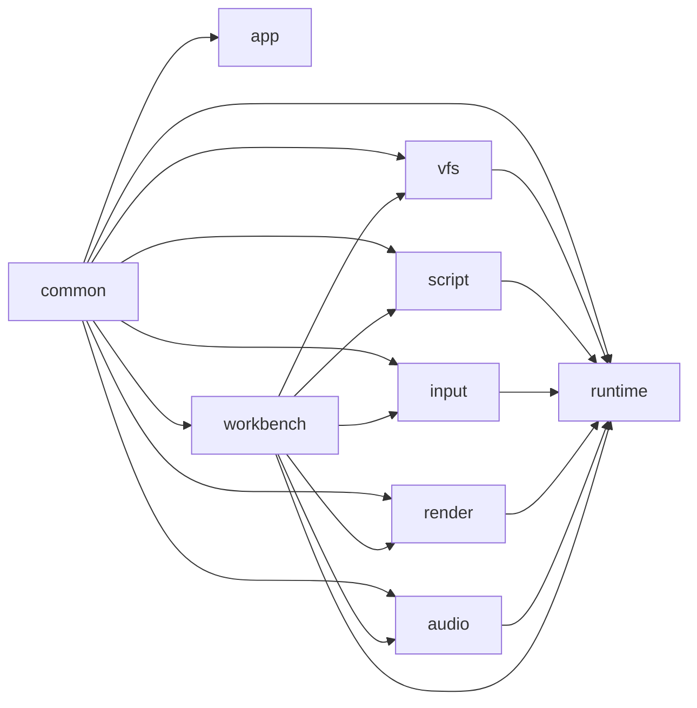
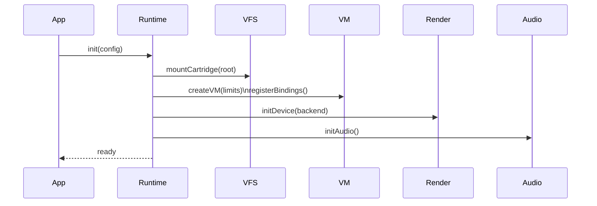
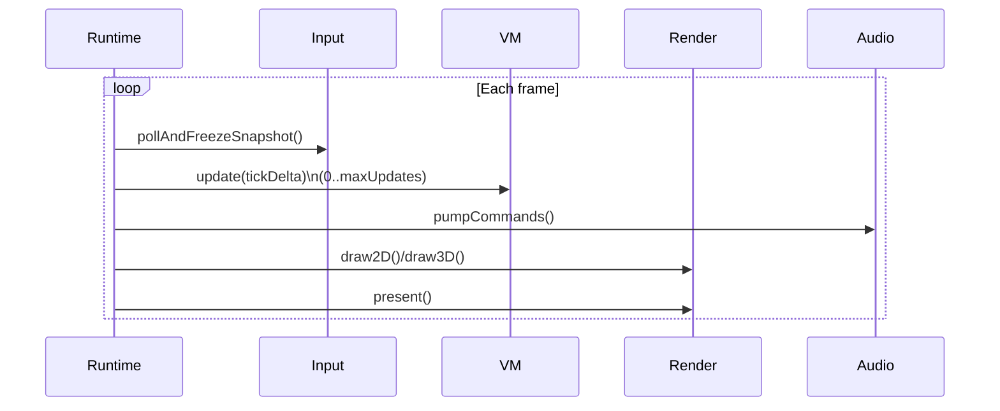

<!-- _blueprint/v0.1/ch3.md -->

# Blueprint v0.1 — Chapter 3: Component Design

## 3.1 Component Responsibilities (Normative)
- [ARCH-02] `app/` — CLI parsing, bootstrap, lifecycle, main loop.
- [ARCH-03] `runtime/` — cartridge load/unload, tick scheduling, orchestration.
- [ARCH-04] `vfs/` — sandboxed namespace mounts, path policy enforcement.
- [ARCH-05] `script/` — Squirrel VM hosting, native bindings, error translation.
- [ARCH-06] `render/` — GPU device init (Diligent), 2D (ThorVG), 3D scene, present.
- [ARCH-07] `audio/` — mixer + module playback integration, SDL audio callback safety.
- [ARCH-08] `input/` — deterministic snapshots and mapping.
- [ARCH-09] `workbench/` — UI, editor, hot reload, debugger/profiler integration.
- [ARCH-10] `common/` — logging, asserts, types, utilities.

## 3.2 Dependency DAG (must remain acyclic)

## 3.3 Key Flows

###3.3.1 Boot & Load

##3.3.2 Tick & Present

    [REQ-19] Fixed tick at 60Hz with max-updates-per-frame cap.

3.4 GPU Backend Selection (Diligent)

    [DEC-10] Diligent is the renderer abstraction for v1.0.

    [DEC-20] Backend selection rule:

        Windows default: DX12; fallback Vulkan if DX12 init fails and user allowed it.

        macOS default: Metal only.

        Linux default: Vulkan; optional OpenGL fallback if enabled by build flag.

        Consequences: CI must cover at least one backend per platform.

3.5 Failure Modes & Recovery

    [REQ-36] Cartridge load failures must produce user-facing diagnostics in Workbench and return to a safe “no cartridge loaded” state.

    [REQ-37] Script runtime errors must:

        be catchable (converted to Status + log + optional on-screen message)

        not crash the host process (unless fatal invariant violated)

    [REQ-38] Renderer device loss must degrade gracefully where supported (minimum: fail with clear message; restart path is vNEXT).

3.6 Test Bounds (component-level)

    [TEST-11] runtime_tick_budget: asserts spiral-of-death cap behavior.

    [TEST-12] cartridge_manifest_parse: malformed manifests rejected with stable error codes.

    [TEST-13] workbench_hot_reload: edit script, reload, verify VM state resets as specified.
