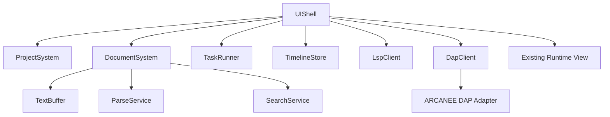
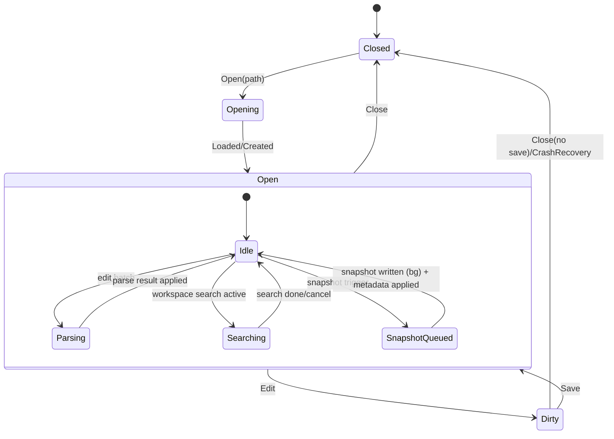

<!-- _blueprint/v0.2/ch3.md -->

# Blueprint v0.2 — Chapter 3: Component Design

## 3.1 Component Inventory
inherit from /blueprint/blueprint_v0.1_ch3.md

### 3.1.1 v0.2 Addendum — “Full IDE” Subsystems
- [ARCH-11] The Workbench expands into a “Full IDE” with the following modules:
  - UIShell
  - ProjectSystem
  - DocumentSystem
  - TextBuffer
  - ParseService
  - SearchService
  - TaskRunner
  - TimelineStore
  - LspClient (Squirrel-only)
  - DapClient + ARCANEE DAP Adapter (Squirrel/runtime baseline)

## 3.2 Responsibilities and Ownership
inherit from /blueprint/blueprint_v0.1_ch3.md

### 3.2.1 IDE module responsibilities (v0.2)
| Module | Responsibilities | Owns | Does NOT own |
|---|---|---|---|
| UIShell | Dockspace + panes; palette; focus; command routing; main-thread apply queue processing; persistence triggers | View-models for panes; UI state; command registry | File I/O; parsing; search; protocol I/O; long tasks |
| ProjectSystem | Workspace root (`samples/<project>`), file tree model, filters, ignore rules, recent files | Project model cache; watcher subscriptions (if any) | Document buffers; parsing; search |
| DocumentSystem | Open buffers, encoding/EOL, autosave + crash recovery hooks, cursor state, open-tabs model | Document objects; per-doc service handles | Workspace file tree |
| TextBuffer | Efficient editing primitives, multi-cursor, column select, undo tree, selection model | Buffer storage; undo tree | Disk persistence; parsing; diagnostics |
| ParseService | tree-sitter incremental parse; run queries; publish highlight spans, folds, outline, locals/injections metadata | Per-doc parse state; query caches | UI decorations; disk I/O |
| SearchService | PCRE2 compile; workspace scan; stream results; replace preview; cancel | Worker jobs; result stream buffers | UI or task execution |
| TaskRunner | Parse tasks TOML; spawn processes; capture stdout/stderr; problem matchers | Process handles; output ring buffers | Rendering; editor text ops |
| TimelineStore | Snapshot scheduling; SQLite metadata; zstd blob store; xxHash dedup; restore+diff | Timeline DB + blob dir | UI; policy configuration |
| LspClient | JSON-RPC transport; Squirrel-only feature surface; diagnostics + nav hooks | Per-workspace LSP sessions | Parsing/highlight (tree-sitter remains primary) |
| DapClient | DAP transport + session state; breakpoints/stack/vars/watches; debug console I/O | Debug session model | Runtime stepping semantics |
| ARCANEE DAP Adapter | Implements DAP server for runtime/Squirrel; maps DAP requests to runtime debug hooks | Adapter process/service | IDE UI |

## 3.3 Dependency Graph and Runtime Topology
inherit from /blueprint/blueprint_v0.1_ch3.md

### 3.3.1 IDE dependency DAG (v0.2)

* [DEC-38] **Main-thread apply queue as the only mutation ingress**

  * Decision: All background services (Parse/Search/Timeline/LSP/DAP/Tasks) publish immutable result packets into a single main-thread apply queue owned by UIShell; only UIShell mutates shared UI-visible models.
  * Rationale: simplifies thread-safety, enforces [REQ-76], prevents partial state updates mid-frame.
  * Alternatives:

    * (A) Fine-grained locks per subsystem.
    * (B) Actor-per-document with direct UI bindings.
  * Consequences:

    * Requires “result packet” schemas per service and a deterministic apply order policy (see 3.4.3).
    * Background services must never call ImGui or mutate UI models directly.

* [DEC-39] **Standard CancelToken**

  * Decision: Introduce a single `CancelToken` interface used across SearchService, ParseService, TimelineStore, TaskRunner (where applicable), and protocol clients.
  * Rationale: “Cancel everywhere” is a core requirement; a unified token improves correctness and testing.
  * Alternatives:

    * (A) std::stop_token (C++20) directly everywhere.
    * (B) ad-hoc atomic flags.
  * Consequences:

    * We may wrap `std::stop_token` behind a stable interface for portability/test injection.
    * All long-running jobs must periodically check cancellation and exit quickly ([REQ-76]).

## 3.4 Data Flow, State Machines, and Invariants

inherit from /blueprint/blueprint_v0.1_ch3.md

### 3.4.1 Document lifecycle (v0.2)

### 3.4.2 Key invariants (IDE)

* [REQ-76] UI thread performs render/input only; never blocks on:

  * parsing, searching, timeline I/O, protocol I/O, process waits.
* [REQ-67] TextBuffer operations are deterministic given the same command stream (selection + edits + undo/redo).
* [REQ-69] ParseService results are always computed from a specific **document revision**; UIShell must discard results whose revision is older than current.
* [REQ-68] SearchService results are scoped to a search session ID and can be cancelled; cancelled sessions must not leak more results after cancellation is acknowledged.
* [REQ-74] Timeline snapshots are immutable; restore always creates a new document revision and can be undone as an editor operation (conceptually).
* [REQ-84] Retention enforcement is deterministic: after inserting snapshot metadata, the store prunes to policy limits.

### 3.4.3 Apply order policy (determinism in UI state updates)

* [DEC-40] **Per-frame apply order**

  * Decision: UIShell applies result packets in the following stable order each frame:

    1. DocumentSystem (open/close/save/restore)
    2. TextBuffer decorations baseline (cursor/selection/undo metadata)
    3. ParseService (highlights/folds/outline)
    4. LspClient diagnostics (Problems list + overlays)
    5. SearchService result stream (search panes)
    6. TimelineStore events (timeline pane)
    7. TaskRunner output/problem matches
    8. DapClient events (debug panes)
  * Rationale: avoids flicker and ensures that highlights/folds correspond to the latest buffer state before diagnostics/search overlays.
  * Alternatives: best-effort apply in arrival order.
  * Consequences:

    * Services must tolerate delayed apply.
    * Tests can assert deterministic state transitions per frame tick.

## 3.5 Failure Modes and Recovery

inherit from /blueprint/blueprint_v0.1_ch3.md

### 3.5.1 IDE-specific failure modes

* [REQ-82] TaskRunner failures:

  * tool not found / non-zero exit → Task Output records exit code, stderr; problem matcher still runs on captured streams.
  * cancellation → process termination policy must be explicit (gentle then hard kill) (see Ch6).
* [REQ-73] LSP failures:

  * server missing/launch fails → degrade gracefully (tree-sitter still provides highlight/folds/outline).
  * protocol errors/timeouts → session reset; show one-time diagnostic in IDE Log Console.
* [REQ-83] DAP failures:

  * adapter unavailable → debug UI remains usable but shows “no session”; breakpoints persist locally.
  * runtime attach fails → show error; ensure runtime non-debug run is unaffected.
* [REQ-74] Timeline failures:

  * SQLite corruption/lock → TimelineStore disables itself for that project and reports error; must not prevent editing.
  * blob write failure → snapshot skipped; metadata not committed; UI not blocked.

## 3.6 Test Bounds and Observability Hooks

inherit from /blueprint/blueprint_v0.1_ch3.md

### 3.6.1 IDE test bounds mapping

* [TEST-27] Dockspace/layout persistence: verify panes exist, layout roundtrip, session restore.
* [TEST-28] TextBuffer property tests: randomized edit streams with undo/redo; multi-cursor/column selection invariants.
* [TEST-29] SearchService: PCRE2 compile; streaming emission; cancel latency; replace preview correctness.
* [TEST-30] ParseService golden tests: incremental edits preserve highlight/fold/outline stability; query loading from assets.
* [TEST-31] TimelineStore: snapshot insert/restore/diff; retention enforcement (15 scripts / 3 others); exclusions honored.
* [TEST-32] TaskRunner: stdout/stderr capture; problem matcher emits file:line diagnostics.
* [TEST-33] DapClient + ARCANEE adapter: connect and basic debug loop (breakpoints/stack/vars/watch/evaluate).
* [TEST-34] TOML layering + keybindings conflict detection + VSCode-like defaults.

### 3.6.2 Observability hooks (IDE)

* [REQ-77] Each service emits duration + queue-depth metrics to logs:

  * Parse batch duration, nodes parsed, highlight span count
  * Search batch duration, files scanned, matches
  * Snapshot duration, bytes written, dedup hits
  * LSP/DAP request latency, reconnect count
* [REQ-78] Dev overlay displays:

  * apply queue depth
  * per-service job counts
  * active cancellations

