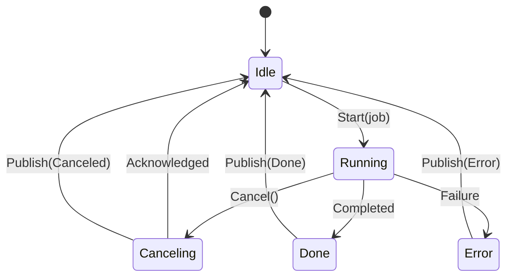

# Blueprint v0.2 — Chapter 6: Concurrency, Determinism, and Synchronization

## 6.1 Concurrency Model
inherit from /blueprint/blueprint_v0.1_ch6.md

### 6.1.1 v0.2 IDE Concurrency Contract
- [REQ-76] **UI thread rule:** UI thread does render + input only.
- [CONC-04] **Worker pool rule:** ParseService, SearchService, TimelineStore, TaskRunner I/O, LspClient I/O, and DapClient I/O run on background threads.
- [DEC-38] **Main-thread apply queue** is the single ingress for UI-visible mutations.

## 6.2 Cancellation and Job Control
inherit from /blueprint/blueprint_v0.1_ch6.md

### 6.2.1 Unified CancelToken
- [DEC-39] Standard CancelToken is required across IDE services.
- [CONC-05] **Cancel semantics**
  - Cancel request is best-effort but must be prompt:
    - [REQ-76] cancel propagation ≤ 50ms p95 (Ch1 budget)
  - Jobs must check cancel token:
    - at minimum once per 4KB of processed text (parse materialization, snapshot compression)
    - once per scanned line in search (or every N lines, N bounded, default 256)
    - once per protocol read/write loop iteration (LSP/DAP)

### 6.2.2 Worker job state machine

## 6.3 Main-thread Apply Queue

* [CONC-06] `MainThreadQueue::Push()` must be thread-safe and lock-free if feasible; if using a mutex, it must be bounded and never taken on the UI thread for long.
* [DEC-40] Apply order policy is fixed (Ch3) to ensure deterministic UI model evolution.

### 6.3.1 Result packet contracts

* [CONC-07] Result packets must include:

  * source subsystem ID (Parse/Search/Timeline/Tasks/LSP/DAP)
  * correlation ID (doc revision, search session ID, task ID, snapshot ID, protocol request ID)
  * monotonic timestamp (for diagnostics ordering only)

## 6.4 Document Revisioning

inherit from /blueprint/blueprint_v0.1_ch6.md

### 6.4.1 IDE revision rules

* [CONC-08] Each document has a `DocRevision` incremented on every applied edit batch.
* [REQ-69] Parse results must be tagged with the revision they were computed from; UIShell discards stale results.
* [REQ-73] LSP change notifications are based on the current revision; LSP diagnostic packets include the revision they correspond to (if server supports; otherwise map by latest known).

## 6.5 TaskRunner Process Control (Cross-platform)

* [REQ-82] Tasks run without terminal emulation; capture stdout/stderr.
* [CONC-09] Cancellation policy for tasks:

  * On cancel: send graceful termination (SIGTERM on POSIX; `GenerateConsoleCtrlEvent` if supported on Windows or `TerminateProcess` fallback after timeout).
  * Timeout before hard kill: default 500ms (configurable; recorded in [DEC-51]).
* [DEC-51] **Task cancel escalation**

  * Decision: cancel uses a two-stage escalation: graceful then hard kill after 500ms.
  * Rationale: avoids orphan processes while giving tools a chance to flush output.
  * Alternatives: immediate kill; long grace period.
  * Consequences: tests simulate hung tasks and ensure cancel returns promptly ([TEST-32]).

## 6.6 Protocol I/O Concurrency (LSP/DAP)

* [CONC-10] LspClient and DapClient each own a dedicated I/O thread (or async loop) that:

  * reads framed messages
  * parses JSON
  * posts decoded events to main-thread queue
* [CONC-11] Message send APIs are thread-safe and may be called from UI thread; sending must enqueue to an I/O thread buffer (no blocking write on UI thread).
* [DEC-50] Message size caps apply to LSP and DAP (Ch5).

### 6.6.1 DAP adapter concurrency (baseline in-process)

* [REQ-83] The baseline ARCANEE adapter must not alter non-debug runtime behavior.
* [CONC-12] Runtime debug hooks are enabled only when a DAP session is active; session begin/end transitions are serialized through the main-thread apply queue to avoid racing runtime state.

## 6.7 Determinism Considerations (IDE and Runtime)

inherit from /blueprint/blueprint_v0.1_ch6.md

### 6.7.1 IDE determinism

* [CONC-13] IDE state evolution must be deterministic given:

  * the same input event stream (mouse/keyboard commands)
  * the same task outputs and protocol messages (captured in tests via deterministic adapters/servers)
* [DEC-40] Apply order policy ensures consistent UI-visible ordering of updates.
* [TEST-33] DAP tests use deterministic adapter behavior (same script, same breakpoints) to ensure repeatable stacks/variables.

## 6.8 Sanitizers and Race Testing

inherit from /blueprint/blueprint_v0.1_ch6.md

### 6.8.1 v0.2 IDE concurrency tests

* [TEST-37] Threaded stress: start/cancel searches repeatedly while editing; assert no deadlocks and UI apply queue remains draining.
* [TEST-38] Timeline stress: rapid edits trigger periodic snapshots; ensure cancel/close document never hangs and no SQLite “busy” errors leak to UI thread.

> These tests are additive and may be gated to nightly CI if runtime is high; if moved to nightly, add an explicit CI policy entry in Ch7 (no “silent skip”).

## 6.9 GPU / Multi-Viewport Notes

inherit from /blueprint/blueprint_v0.1_ch6.md

### 6.9.1 Docking + multi-viewport sync

* [DEC-27] ImGui docking branch via DiligentTools is the source of truth for docking + multi-viewport.
* [CONC-14] ImGui viewport rendering remains on the UI thread; any GPU resource updates triggered by IDE panels must be queued and executed within the existing render frame boundaries (no background GPU calls).

