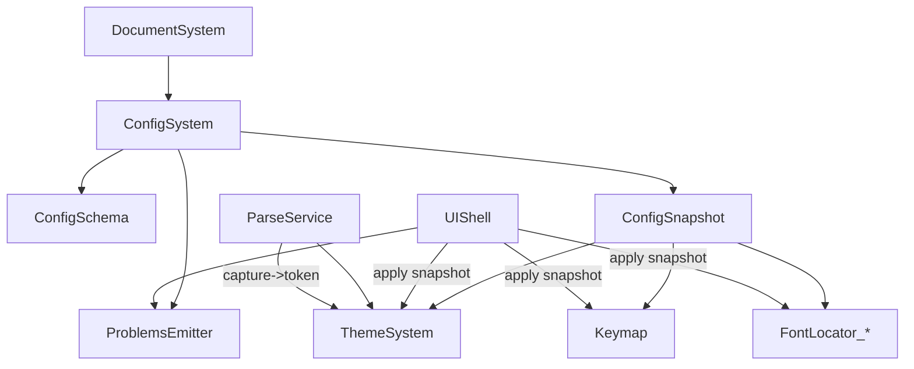
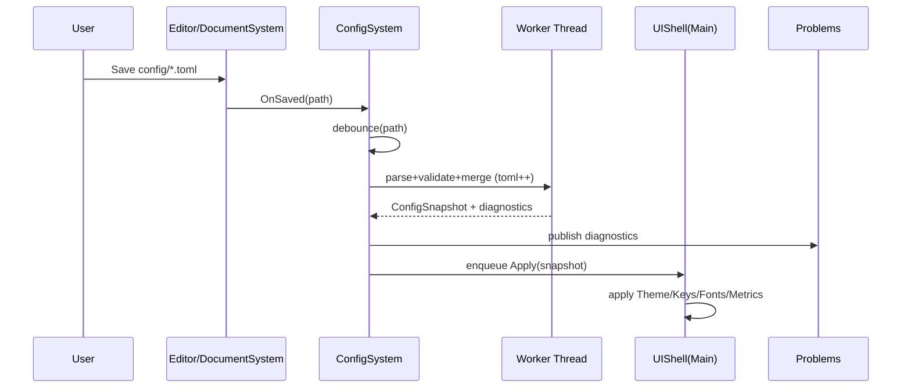

# Blueprint v0.3 — Chapter 3: Component Design

## [ARCH-03] Components Overview (v0.3 delta)
This chapter defines the new/modified components introduced by [CR-0044] and how they fit into the existing IDE loop.

### New components
- **ConfigSystem**: load/merge/validate `config/*.toml`, emit diagnostics, produce immutable `ConfigSnapshot`, debounce + schedule apply. [ARCH-12], [API-17], [REQ-90], [REQ-91], [REQ-97], [REQ-98]
- **ThemeSystem**: scheme registry, editor palette, syntax palette, derived ImGui style (+ optional overrides). [REQ-93], [REQ-94], [DEC-63]
- **Keymap**: parse `config/keys.toml`, normalize chords, resolve conflicts deterministically. [REQ-96]
- **FontLocator_* (platform)**: system font discovery + match + safe rebuild with last-known-good retention. [REQ-92], [DEC-65]

### Modified components
- **DocumentSystem**: emits `OnSaved(path)` for IDE saves. [REQ-91]
- **UIShell**: Configuration menu, explorer root mode switch, snapshot application, Problems ingestion. [REQ-95], [DEC-66], [REQ-97]
- **ParseService (Tree-sitter)**: multi-language routing `.nut` + `.toml`, capture→token mapping, theme-driven token colors. [REQ-94]

---

## [ARCH-12] Config Hot-Apply Pipeline (Component Responsibilities)
### 1) ConfigSystem
**Responsibilities**
- Discover config root and ensure required files exist where mandated.
  - `config/color-schemes.toml` must exist in packaged distribution; if missing in dev runs, may be created from built-in template (see Ch8). [REQ-90]
- Parse TOML with `toml++` and enforce UTF-8 IO boundary policy. [REQ-98], [DEC-64]
- Validate schema + semantics; unknown keys warn; invalid values fallback per-field. [REQ-91], [REQ-97]
- Emit Problems diagnostics (and optional logs) for parse/validation. [REQ-97], [REQ-02]
- Produce immutable `ConfigSnapshot`:
  - `EditorConfig`, `GuiConfig`, `KeysConfig`, `SchemeRegistry`, `ActiveSchemeId`
- Debounce reload and apply:
  - Off-thread parse/validate
  - Main-thread apply queue
- Maintain **LastKnownGood** snapshot and apply partial updates safely:
  - If parse fails: keep LastKnownGood and emit diagnostics.
  - If validate fails for a field: fallback that field only, preserve others. [REQ-91]

**Key invariants**
- Never apply a partially-parsed structure; only apply a fully-built `ConfigSnapshot` (with per-field fallbacks already resolved).
- Ordering is deterministic: file merge order is stable and documented; keybindings conflict resolution is stable “last definition wins” within the file. [REQ-96]
- No font file paths are accepted; any such keys are ignored + warned. [REQ-92]

### 2) ThemeSystem
**Responsibilities**
- Own scheme registry (built-ins + `config/color-schemes.toml` definitions).
- Provide:
  - `EditorPalette` (UI colors: background/foreground/selection/caret/etc.)
  - `SyntaxPalette` (stable IDE token set)
  - `ImGuiStyleColors` (derived mapping MVP; optional overrides) [DEC-63]
- Expose “apply theme” operation used by UIShell to:
  - update editor colors
  - update token-color lookup used by Tree-sitter highlighter
  - update ImGui style colors

**Invariants**
- **Single source of truth**: active scheme drives editor UI, syntax tokens, and ImGui colors. [REQ-93]
- Unknown Tree-sitter captures map to a deterministic fallback (scheme editor foreground, optional dim) to avoid uncolored text. [REQ-94]

### 3) Keymap
**Responsibilities**
- Parse `[keys]` table in `config/keys.toml`.
- Normalize chord strings:
  - supports multi-modifier (`Ctrl+Shift+P`)
  - supports `primary` abstraction (Ctrl Win/Linux, Cmd macOS). [REQ-96]
- Build two maps:
  - `ActionId -> vector<Chord>`
  - `Chord -> ActionId` (for dispatch)
- Detect conflicts and resolve deterministically: last definition wins + warning diagnostic. [REQ-96], [REQ-97]

**Invariants**
- Normalization is platform-aware but deterministic.
- If invalid chord syntax: warn, drop chord only (do not drop entire action).

### 4) FontLocator_* (platform)
**Responsibilities**
- Enumerate installed fonts and perform best-match selection given `FontSpec`.
- Support weight/style mapping and “closest match” fallback.
- Ensure safe rebuild semantics:
  - attempt rebuild into new resources/atlas
  - if rebuild fails, retain previous valid font resources and emit diagnostics. [REQ-92]

**Invariants**
- No file-path loading exists; keys implying paths are ignored with diagnostics. [REQ-92]
- If backend is unavailable (e.g., fontconfig missing), use deterministic default and warn; never crash. [DEC-65]

---

## [ARCH-20] Dependencies DAG (v0.3)

**Dependency rules**

* `ThemeSystem`, `Keymap`, and `FontLocator_*` must be pure-ish “apply-only” consumers of `ConfigSnapshot`; they must not read TOML directly. [API-17]
* Diagnostics are centralized through existing Problems infrastructure; ConfigSystem is responsible for creating the structured diagnostic objects. [REQ-97]

---

## [ARCH-21] Runtime State & Data Model

### ConfigSnapshot (immutable)

* `paths.config_root`
* `schemes`: `map<scheme_id, Scheme>`
* `active_scheme_id`
* `editor`: font spec, indentation, view prefs, etc.
* `gui`: ui_font spec, metrics, behavior
* `keys`: action→bindings map + normalized chord table
* `version`: internal monotonically increasing integer, incremented on successful rebuild for change detection.

### LastKnownGood handling

* `ConfigSystem` keeps:

  * `ConfigSnapshot last_good`
  * `ConfigSnapshot pending` (optional)
* Apply is only performed for a snapshot that has passed parse + validation (with per-field fallbacks already baked in). [REQ-91]

---

## [ARCH-22] Control Flow

### Save → Reload → Apply (IDE-only)

### Apply ordering (main thread)

1. Update scheme registry + active scheme.
2. Apply theme:

   * editor palette
   * syntax palette
   * ImGui style colors
3. Apply keymap (rebuild dispatch tables).
4. Apply fonts:

   * attempt rebuild
   * on failure keep previous and emit diagnostics
5. Request repaint/re-highlight where needed (token colors). [REQ-94]

---

## [ARCH-23] Validation Rules & Determinism

* **Unknown keys**: warning diagnostic “Unknown configuration key”; ignored. [REQ-97]
* **Invalid types/values**: warning diagnostic and field fallback only. [REQ-91]
* **Missing referenced IDs** (scheme id): fallback to default scheme id, warning diagnostic. [REQ-91]
* **Key conflicts**: last definition wins; warnings include both action id and chord. [REQ-96]
* **Determinism rule**: all merges and conflict resolutions are stable and documented; no hash-map iteration order may affect outcomes (sort keys when emitting derived artifacts or when serializing for tests). [TEST-41]

---

## [ARCH-24] Failure Modes (Non-fatal)

* TOML parse error → keep last_good; emit error diagnostic with best-effort range. [REQ-97]
* UTF-8 invalid IO → keep last_good; emit error diagnostic. [REQ-98]
* Semantic validation errors (unknown scheme id, invalid enum) → field fallback; emit warning diagnostic. [REQ-91]
* Font backend failure / atlas rebuild failure → keep previous font; emit error diagnostic; UI remains usable. [REQ-92], [TEST-42]

---

## [ARCH-25] Test Bounds for Components

* ConfigSystem:

  * parsing + validation + per-field fallback + diagnostics range behavior. [TEST-39]
  * debounce correctness (coalescing multiple saves). (covered in [TEST-39] as timing-free “manual tick” harness)
* ThemeSystem:

  * derived ImGui mapping determinism across platforms. [TEST-40]
  * unknown capture fallback policy. [TEST-40]
* Keymap:

  * `primary` normalization by platform; conflict determinism. [TEST-41]
* FontLocator:

  * rejects font-path keys; fallback selection; last-known-good retention on failure. [TEST-42]
* UIShell menu:

  * “Open Config Folder” explorer root mode switch without changing project root. [TEST-43]

